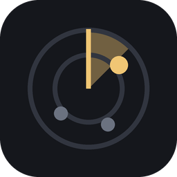
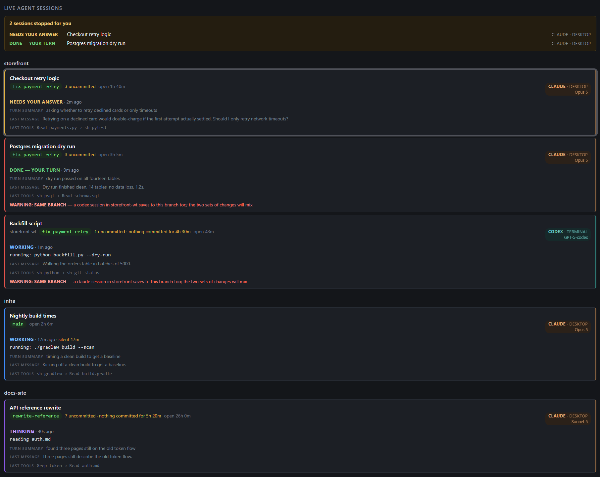

# Airspace




Two small tools for anyone running several Claude Code and Codex sessions at
once. **The board** shows what every live session is doing and which ones have
stopped and are waiting on you. **The session-start hook** warns a new session,
at the moment it opens, that another session is already working in the same
place.

One answers *what is happening right now*. The other answers *is it safe to
start work here* — before the damage rather than after.



## Why it exists

Running several coding agents at once is now ordinary. Keeping track of them is
not. Two things go wrong, and they need different answers.

**A session stops and nobody notices.** It finishes its turn, or pauses to ask
a question, then sits there for twenty minutes while you work in another
window. The board answers this: every stopped session is listed at the top of
the page, and the count goes in the page title, so the taskbar button reads
"2 waiting" without the board even being open.

**Two sessions end up in the same place.** The same folder, or the same branch,
and whichever saves last quietly wins. Spotting that afterwards is no use — the
work is already gone. So the hook runs at the front of every new Claude Code
session and says, before a single file is touched, that somebody else is
already there. The board flags the same collisions in red for sessions that are
already running.

Every tool that solves this properly wants to launch the agents itself, inside
a terminal it controls. The desktop apps have matured to the point where the
terminal is a preference rather than a requirement — and a session started in
one is invisible to a tool that did not launch it.

So this watches from outside instead. It reads the files Claude Code and Codex
already write about themselves, and asks git about each folder. Read-only
throughout: it never writes to a session, starts anything, or plans work.

The design assumes an operator rather than an engineer — someone directing
several agents across several repositories, who needs to know which one wants
them next, and who would rather click than type.

The two pieces share one detector. `dashboard.py` finds the live sessions and
flags the collisions; `hooks/git-workspace-brief.py` calls the same two
functions, `session_rows()` and `flag_clashes()`, so the page and the warning
can never disagree about who is running.

## What you need

**Windows**, Python 3, and Claude Code or Codex already installed. No packages,
no install step — the board is one file of standard library.

This was developed using Windows installs of Codex and Claude Code. Other
operating systems may store session files differently and have not been tested.

## Running the board

Double-click `board.cmd`, or:

```
python dashboard.py
```

It opens at <http://127.0.0.1:8765>. Use the numeric address rather than
`localhost` — the server is IPv4-only and Windows tries IPv6 first, which
costs about two seconds a page.

Close the window and the board stops about a minute later, giving back the
memory it was using.

For a Desktop icon: right-click `board.cmd`, **Show more options**, **Send
to**, **Desktop (create shortcut)**. Then right-click the shortcut,
**Properties**, **Change Icon**, and point it at `assets/icon.ico`.

## Wiring up the session-start hook

`hooks/git-workspace-brief.py` runs when a Claude Code session starts, in any
repository. It reports the branch, the trunk, how many files are uncommitted,
the worktree list, and any collision with a session already running. It takes
about a second against a fifteen-second budget, paid once per session rather
than per turn.

Add it to `~/.claude/settings.json`:

```json
"SessionStart": [
  { "hooks": [ { "type": "command", "timeout": 15,
      "command": "python \"<path to this repo>/hooks/git-workspace-brief.py\"" } ] }
]
```

If `dashboard.py` cannot be loaded, the brief says so out loud rather than
reporting no collisions. Silence would read as "nobody else is here", which is
the one wrong answer that costs work.

## Reading the board

**The strip at the top** lists every session that has stopped. One that *needs
your answer* is holding a task open; one that is *done* simply finished its
turn. Both mean nothing moves until you act, which is why they share the strip
— but they are not the same thing, so questions sort first. Each line ends with
the agent and the window to go and find it in.

**The left edge of a card** is what that session is doing:

| State | Means |
|---|---|
| working | mid-tool-call |
| thinking | a tool finished, no reply yet |
| needs your answer | asked a question, or a plan is up for approval |
| done — your turn | finished its turn and stopped |
| no recent activity | nothing in the transcript to go on |

A card glows for 25 seconds on entering "needs your answer" or "done";
replying puts the session back to work and the glow stops.

**Along the top of a card**: the branch, how many files are uncommitted, and
how long the session has been open. Uncommitted files plus nothing saved to
that branch for two hours earns its own chip — that is the state where a crash
or a careless branch switch costs work.

**The right edge** names the agent, the app it is running in, and the model.
The board cannot open a session for you, so naming the window is the next best
thing.

**A red card is a collision.** *Same worktree* — another session is editing the
same files, and whoever saves last wins. *Same branch* — another session in a
different folder saves to this branch too, so the two sets of changes will mix.

## Two honest limits

A session parked on a permission prompt reads as `working`. The transcript
records the tool call whether or not it has been approved, so separating the
two would mean writing into the session, which this board deliberately does
not do. What it can say is that a busy session has written nothing for a
while: after ten minutes a working card reads "silent 14m". That is a fact,
not a diagnosis — it fits a session waiting on approval and a session running
a slow test suite equally well, and the card does not pretend to know which.

There is no click-through to a session either, and not for want of an address.
The desktop app registers exactly the right routes, and the board can work out
the ids they want. The routes sit behind a server-side feature flag that is
off, and released builds ignore the override that would force it on. The
wiring is all there; the switch is not ours. [docs/internals.md](docs/internals.md)
records what the change would be the day it flips.

## This is not a harness, and that is the whole trade

There is a second kind of tool in this space, and it is worth knowing which one
you want. Products like [AgentsRoom](https://agentsroom.dev/) and
[herdr](https://github.com/herdrdev/herdr) *start* the agents themselves,
inside a terminal they own, so they can read what is drawn on that terminal and
type back into it. That buys them things this board will never do: telling a
permission prompt from a slow test, answering it for you, spawning an agent,
killing one.

The price is that they must have launched it. A session started some other way
is not theirs, so it does not appear.

This board makes the opposite trade. It launches nothing and owns nothing,
which means it sees every session on the machine however it was started, and
it cannot break one. It also cannot help you: no answering a prompt, no
starting a session, no stopping one.

Pick by what you need. To drive several agents from one window, use a harness.
To know what is already running — including the sessions a harness cannot see
— use this. They answer different questions, and running both is reasonable.

## Further reading

- **[One-line summaries from a local model](docs/summaries.md)** — optional.
  A small model running locally writes the summary line on each card, and
  gives the graphics memory back when the board closes.
- **[Internals, and how to add a harness](docs/internals.md)** — how the board
  is put together, and how to teach it about a coding agent it does not yet
  know: write one function returning rows in a documented shape, and add it to
  one list.
